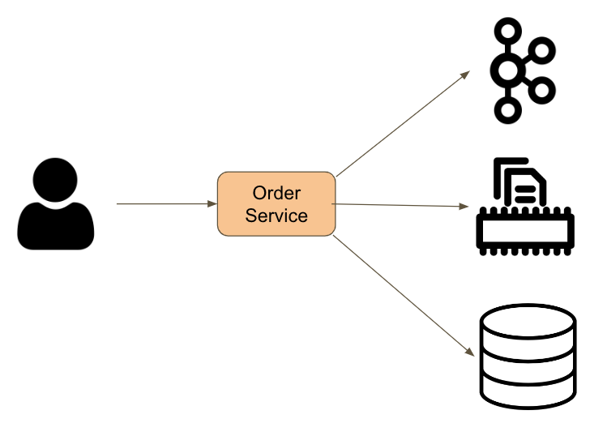
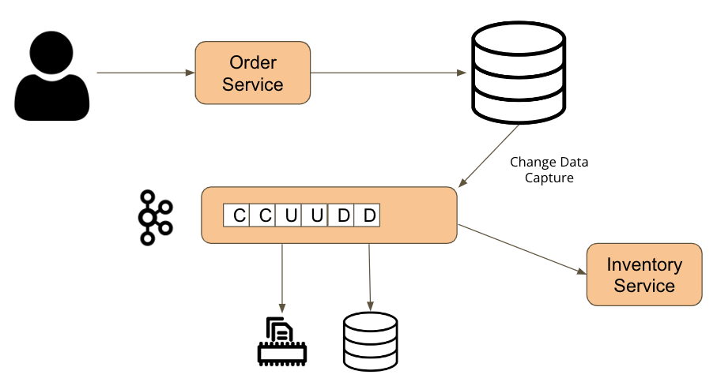
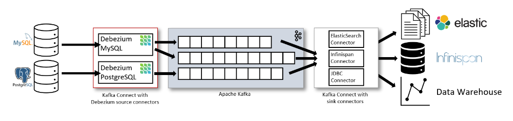
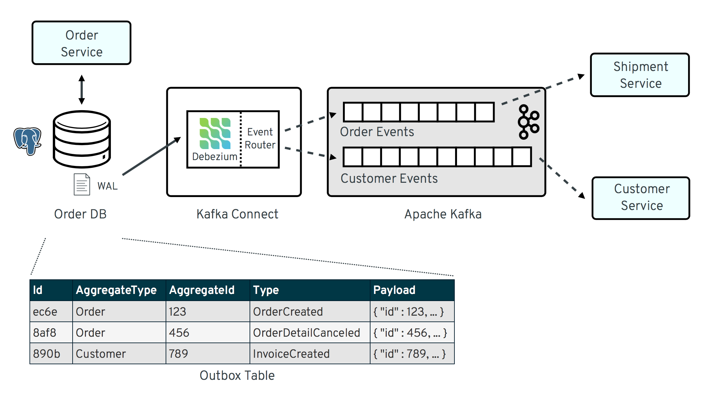
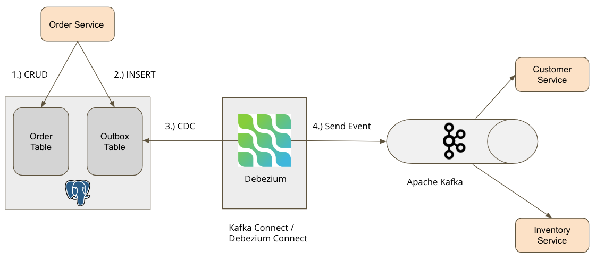

# Debezium Outbox Pattern
The idea of this project is to show how to use the Outbox pattern via Debezium Change Data Capture (CDC).
Debezium is used as a connector between the database in our case Postgres and the Kafka topic.

### Story behind this project
A common case if we use several independent systems, such as a database, message broker, caching system, how to synchronize so that the data is the same everywhere.

One of the simplest ways was to use "ChainedTransactionManager".
ChainedTransactionManager works on the principle that it is necessary to list all transactions participating in the chain. 
For example, the first transaction can be a database via jpa (JpaTransactionManager) and the second transaction can be Kafka (KafkaTransactionManager).

Possible scenarios:
- The first transaction is successfully committed and the second transaction is moved on. 
  The second transaction also commits successfully.

- The first transaction commits unsuccessfully and a rollback occurs. 
  The second transaction is skipped.

- The first transaction is successfully committed and the second transaction is moved on. 
  Another transaction commits unsuccessfully.
  **(Here we have a problem because two independent systems have mismatched data)**

We can use the "ChainedTransactionManager" approach if we are sure that one of the transactions will always work, 
while for the other there is a possibility that it might be rollbacked.

If we are not sure for any transaction that it will be successful or unsuccessful, 
a better solution is to use the CDC mechanism through the outbox pattern.




## Stream changes from the database




```java
    @Transactional
    public void placeOrder(OrderRequest orderRequest) {
        var order = OrderMapper.toOrderEntity(orderRequest);

        order.setCreatedAt(Timestamp.from(Instant.now()));
        order.setStatus(OrderStatus.PENDING);
        order.setId(UUID.randomUUID());

        orderRepository.save(order);
        outBoxRepository.save(OutBox.builder()
                .aggregateId(order.getId())
                .aggregateType(ORDER)
                .type(ORDER_CREATED)
                .payload(mapper.convertValue(order, JsonNode.class))
                .build());
    }
```

A safer way to successfully commit or rollback is to use only one system in the transaction, for example, in our case, the database.
When saving data in the order table, we additionally save the same data as payload in the outbox table.
A safer way to successfully commit or rollback is to use only one system in the transaction, for example, in our case, the database.

When saving data in the order table, we additionally save the same data as payload in the outbox table. 
When the data is successfully saved in the database, the log is also written in the WAL (Write-Ahead Logging) file. 
In Postgres, the log file is called WAL, while in other databases the log file is called differently but has the same purpose. 
Debezium CDC reads changes from the WAL file and sends them to the Kafka topic.


### What is Debezium (CDC)?
- Debezium CDC is an open source distributed platform that is triggered during insert, update, delete events in the database.
- Debezium CDC currently supports these databases or has created connectors for them
  - MongoDB, MySQL, PostgreSQL, SQL Server, Oracle, Db2, Cassandra, Spanner
- Data is read from transaction logs
- It is possible to use 3 variants of Debezium
  - Debezium library that is added inside maven or gradle.
  - Debezium standalone server
  - Debezium Connect (Kafka Connect + pre-installed connectors for databases)
    - In our project, we will use the Debezium Connect option



## Outbox pattern (Debezium)


In the outbox pattern, the table usually contains several columns, named: Id, AggregateType, AggregateId, Type, Payload.
- The Id column indicates a randomly generated Id
- The AggregateType column is used for the name of the table from which the payload arrived.
- The AggregateId column is the id from the table from which the payload arrived
- The Type column indicates which action it is, eg Create, Update, Delete.
- The Payload column contains json from the table where some change happened

When the data is saved in the database, the log is also available in the WAL file from where Debezium reads the data.

Within Debezium there is an EventRouter mechanism that serves as a router for redirecting messages to a specific topic. 
Usually, based on the AggregateType column, it is determined to which topic the data is sent.

After the data has been sent to the Kafka topic, for example (Order, Customer), 
it is ready for consumption by the Shipment, Customer and other services.


Example demo from this project.

An order is sent to the order service, which is saved in the order table. 
The data saved in the order table is also saved in the outbox table. 
When the data is available in the WAL file, it will be read by Debezium.
The data is sent to the "Order" topic. 
Both Customer service and Inventory service listen on the "Order" topic to get data.


## Kafka Connect / Debezium Connect

Debezium connect is Kafka connect + Debezium connectors for different database types such as 
MongoDB, MySQL, PostgreSQL, SQL Server, Oracle, Db2, Cassandra, Spanner.
It is also possible to use Kafka Connect, but in that case it is necessary to additionally add a connector for a 
particular database within Docker image or Docker compose. 
This means that configuration for the connector can be easily added via REST. 
It is also possible to delete the configuration and edit it. 
It is also possible to stop the connector and restart it.

Configuration
- GROUP_ID (a unique string that identifies the Kafka Connect cluster group)\
  If we decide to have a Kafka Connect cluster, it is important that the GROUP_ID is the same so as not to read the data twice.
- CONFIG_STORAGE_TOPIC (the topic to store connector configuration data in)\
  The configuration topic contains the configuration json files that we added to the connector. 
  The json file specifies the source as the database and the sink as the kafka topic.
- OFFSET_STORAGE_TOPIC (the topic to store offset data for connectors in)\
  Offset topic serves to know where we stopped with reading data. A very important thing if Kafka connect is restarted.
- STATUS_STORAGE_TOPIC (the name of the topic where connector configuration status updates are stored)\
  The status topic is used to know whether our connector is up or down.

```yaml
"name": "order_outbox_connector",
  "config": {
    "connector.class": "io.debezium.connector.postgresql.PostgresConnector",
    "database.*": "....",
    "key.converter": "org.apache.kafka.connect.storage.StringConverter",
    "value.converter": "org.apache.kafka.connect.json.JsonConverter",
    "table.include.list": "public.out_box"
    ….
  }
}
```
[Debezium Postgres Connector Docs](https://debezium.io/documentation/reference/stable/connectors/postgresql.html)\
This is the basic connector configuration.
It is necessary to define data for the database, such as hostname, port, user, password.
It is also necessary to define the key and value converter used when sending data to the Kafka broker (producer).
You should also specify the name of the table from which the data will be read, in this case it is (public.out_box).

```yaml
"config": {
    "transforms": "outbox",
    "transforms.outbox.type": "io.debezium.transforms.outbox.EventRouter",
    "transforms.outbox.table.expand.json.payload": "true",
    "transforms.outbox.route.topic.replacement": "${routedByValue}.events",
    "transforms.outbox.table.fields.additional.placement": "type:header:eventType",
    "transforms.outbox.table.field.event.key": "aggregate_id",
    "transforms.outbox.table.field.event.payload": "payload",
    "transforms.outbox.route.by.field": "aggregate_type"
  }
```
[Debezium Event Router Docs](https://debezium.io/documentation/reference/stable/transformations/outbox-event-router.html)\
In this part, we define which data from the outbox table will be sent under key (event.key) and which under value (event.payload).
It is possible to define the data that will be in the header (additional.placement).
Also very important is the part (route.by.field) that is put as the "aggregate_type" column. 
Currently, inside the column "aggregate_type" we have data ORDER, CUSTOMER, INVENTORY which serve us as the name of the topic where the data is sent.
In this part "${routedByValue}.events" routedByValue is replaced by ORDER, CUSTOMER, INVENTORY so the actual topic name is "ORDER.events", "CUSTOMER.events", "INVENTORY.events".


